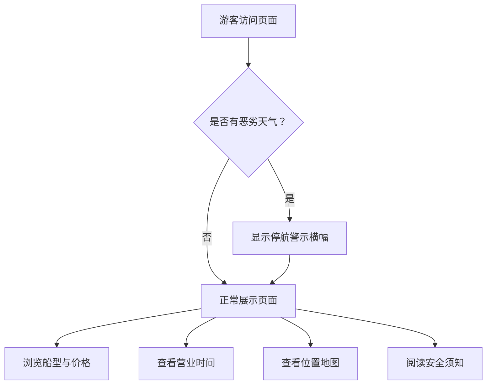

## 1. 产品概述

公园游船码头指南是一个面向游客的单页信息展示网站，帮助游客快速了解游船码头的船型、价格、营业时间、排队位置和安全须知等核心信息，提升游园体验。

- 核心目的：提供清晰、直观的游船码头信息服务
- 目标用户：公园游客，包括家庭亲子、情侣、朋友团体等
- 产品价值：减少游客咨询成本，提升码头运营效率和游客满意度

## 2. 核心功能

### 2.1 用户角色

| 角色 | 注册方式 | 核心权限 |
|------|----------|----------|
| 游客 | 无需注册 | 浏览所有游船码头信息 |

### 2.2 功能模块

1. **天气停航提示**：顶部最显眼位置展示恶劣天气停航警示
2. **船型与价格**：展示亲子船、电动船等不同船型的详细信息和价格
3. **营业时间**：清晰展示开放时间和季节调整
4. **排队位置地图**：可视化地图标注码头位置和排队区域
5. **安全须知**：列出乘船安全注意事项

### 2.3 页面详情

| 页面名称 | 模块名称 | 功能描述 |
|----------|----------|----------|
| 首页 | 天气停航横幅 | 固定在页面顶部，红色醒目展示恶劣天气停航信息，可手动关闭 |
| 首页 | 船型价格卡片 | 分卡片展示亲子船、电动船等船型，包含图片、名称、价格、适用人群、载客量等 |
| 首页 | 营业时间信息 | 展示平日/周末/节假日营业时间，季节调整说明 |
| 首页 | 码头位置地图 | SVG 示意图标注码头位置、排队区、登船口、售票处等 |
| 首页 | 安全须知列表 | 以图标+文字形式列出安全注意事项 |
| 首页 | 页脚信息 | 咨询电话、公园地址等辅助信息 |

## 3. 核心流程

游客打开页面后，首先看到顶部的天气提示（如有），向下滚动依次浏览船型价格、营业时间、位置地图和安全须知。

## 4. 用户界面设计

### 4.1 设计风格

- **主色调**：湖水蓝 (#0EA5E9) 作为主色，代表水面和清新感
- **辅助色**：森林绿 (#10B981) 代表公园自然气息，警示红 (#EF4444) 用于天气提示
- **按钮风格**：圆角矩形，hover 有轻微上浮效果
- **字体**：标题使用圆润友好的"Noto Sans SC"，正文清晰易读
- **布局风格**：卡片式布局，信息分区明确，大量留白
- **图标风格**：使用 Lucide 线性图标，简洁现代

### 4.2 页面设计概览

| 页面名称 | 模块名称 | UI 元素 |
|----------|----------|---------|
| 首页 | 天气停航横幅 | 红色渐变背景、白色加粗文字、警告图标、可关闭按钮、顶部固定 |
| 首页 | 船型价格卡片 | 彩色卡片、船型图片/图标、价格标签、适用人群徽章、参数列表 |
| 首页 | 营业时间 | 时钟图标、时间表格、季节调整提示条 |
| 首页 | 位置地图 | 蓝色调 SVG 地图、位置标注点、图例说明 |
| 首页 | 安全须知 | 图标网格布局、警示色强调、简洁文字说明 |

### 4.3 响应式

- 桌面端优先设计，自适应到平板和手机
- 移动端卡片垂直堆叠，地图保持可缩放
- 触摸优化：按钮和可点击区域不小于 44px

### 4.4 动画效果

- 页面加载时元素渐入，错峰出现
- 卡片 hover 时有轻微上浮和阴影加深
- 天气提示横幅有脉冲动画吸引注意
- 地图标注点有呼吸动画
