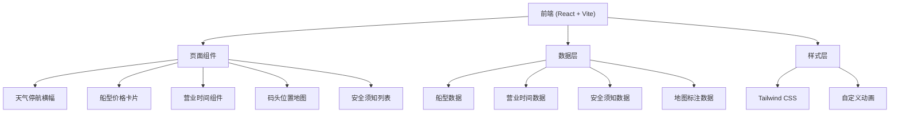

## 1. 架构设计



## 2. 技术说明

- **前端框架**：React@18 + TypeScript
- **构建工具**：Vite@5
- **样式方案**：Tailwind CSS@3
- **图标库**：lucide-react
- **状态管理**：React useState（简单场景，无需 zustand）
- **数据来源**：Mock 数据（前端内置）

## 3. 路由定义

| 路由 | 用途 |
|------|------|
| / | 首页 - 游船码头完整指南 |

## 4. 数据模型

### 4.1 船型数据结构

```typescript
interface BoatType {
  id: string;
  name: string;
  category: 'family' | 'electric' | 'paddle' | 'bicycle';
  price: number;
  priceUnit: string;
  capacity: number;
  suitableFor: string[];
  description: string;
  features: string[];
  icon: string;
  color: string;
}
```

### 4.2 营业时间数据结构

```typescript
interface BusinessHours {
  weekday: string;
  weekend: string;
  holiday: string;
  seasonNote?: string;
  lastBoarding: string;
}
```

### 4.3 安全须知数据结构

```typescript
interface SafetyRule {
  id: string;
  icon: string;
  title: string;
  description: string;
  level: 'warning' | 'info' | 'required';
}
```

### 4.4 地图标注数据结构

```typescript
interface MapMarker {
  id: string;
  type: 'ticket' | 'queue' | 'boarding' | 'restroom' | 'storage';
  label: string;
  x: number;
  y: number;
  description: string;
}
```

## 5. 项目结构

```
src/
├── components/
│   ├── WeatherBanner.tsx      # 天气停航提示横幅
│   ├── BoatCard.tsx           # 船型价格卡片
│   ├── BusinessHours.tsx      # 营业时间组件
│   ├── DockMap.tsx            # 码头位置地图
│   ├── SafetyRules.tsx        # 安全须知列表
│   └── SectionHeader.tsx      # 区块标题组件
├── data/
│   ├── boats.ts               # 船型 mock 数据
│   ├── hours.ts               # 营业时间数据
│   ├── safetyRules.ts         # 安全须知数据
│   └── mapMarkers.ts          # 地图标注数据
├── pages/
│   └── Home.tsx               # 首页
├── App.tsx
├── main.tsx
└── index.css
```

## 6. 核心组件说明

### 6.1 WeatherBanner
- 固定在页面顶部
- 红色渐变背景，白色加粗文字
- 警告图标 + 闪烁动画
- 可手动关闭按钮
- 默认显示（演示效果）

### 6.2 BoatCard
- 卡片式布局，带图片/图标区域
- 价格标签醒目展示
- 适用人群徽章标签
- 载客量、特色等参数列表
- hover 上浮动效

### 6.3 DockMap
- SVG 绘制的码头示意图
- 标注点带呼吸动画
- 图例说明
- 响应式缩放

### 6.4 SafetyRules
- 图标 + 文字网格布局
- 按重要程度分级显示
- 警示项目高亮
